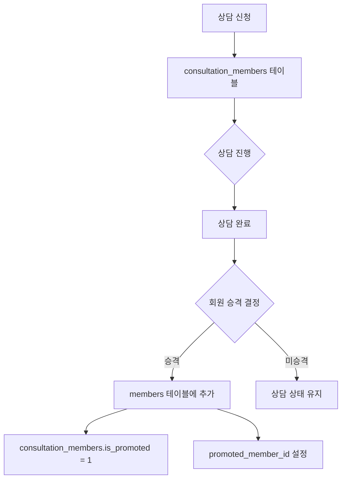

# 상담 회원과 일반 회원 분리 구현

## 📋 요청사항 분석

사용자가 요청한 기능:
1. **상담 대상자와 정식 회원 분리**: 별도 테이블로 관리
2. **회원 승격 기능**: 상담 대상자를 정식 회원으로 승격
3. **승격 후 상태 관리**: 상태만 변경 (데이터 삭제 안함)
4. **승격 시 추가 정보 수집**: 회원권, 결제 정보 등
5. **상담 상세 수정 기능**: 상담 내용 편집 가능

## 🏗️ 시스템 아키텍처 설계

### 데이터베이스 구조

#### 1. consultation_members 테이블 (신규)
```sql
CREATE TABLE consultation_members (
  id INTEGER PRIMARY KEY AUTOINCREMENT,
  name TEXT NOT NULL,
  phone TEXT,
  email TEXT,
  gender TEXT,
  birth_date INTEGER,
  first_visit INTEGER,
  health_conditions TEXT,
  fitness_goals TEXT, -- JSON 문자열
  staff_id INTEGER,
  staff_name TEXT,
  consultation_status TEXT NOT NULL DEFAULT 'pending',
  notes TEXT,
  is_promoted INTEGER DEFAULT 0, -- 승격 여부
  promoted_at INTEGER, -- 승격일시
  promoted_member_id INTEGER, -- 승격 후 회원 ID
  created_at INTEGER DEFAULT (cast(strftime('%s', 'now') as integer)),
  updated_at INTEGER DEFAULT (cast(strftime('%s', 'now') as integer)),
  FOREIGN KEY (staff_id) REFERENCES staff(id) ON DELETE SET NULL,
  FOREIGN KEY (promoted_member_id) REFERENCES members(id) ON DELETE SET NULL
);
```

#### 2. 기존 members 테이블 (유지)
- 정식 회원 정보 저장
- 회원권, 결제 정보 포함

### 데이터 플로우



## 🔧 구현 내용

### 1단계: 데이터베이스 스키마 구현 ✅

#### 파일: `src/database/setup.ts`
- `consultation_members` 테이블 생성
- 승격 관련 필드 추가 (is_promoted, promoted_at, promoted_member_id)
- 외래키 관계 설정

#### 파일: `src/database/consultationRepository.ts`
- `ConsultationMemberData` 인터페이스 정의
- CRUD 함수 구현:
  - `createConsultationMember()`
  - `getAllConsultationMembers()`
  - `updateConsultationMember()`
  - `deleteConsultationMember()`
  - `getConsultationMemberById()`

### 2단계: 백엔드 API 구현 ✅

#### 파일: `src/main/main.ts`
IPC 핸들러 추가:
- `get-all-consultation-members`
- `add-consultation-member`
- `update-consultation-member`
- `delete-consultation-member`
- `get-consultation-member-by-id`

#### 파일: `src/main/preload.js`
window.api에 메서드 추가:
- `getAllConsultationMembers()`
- `addConsultationMember()`
- `updateConsultationMember()`
- `deleteConsultationMember()`
- `getConsultationMemberById()`

### 3단계: 프론트엔드 데이터 분리 ✅

#### 파일: `src/pages/ConsultationDashboard.tsx`
- `loadMembers()` 함수 수정: `getAllMembers()` → `getAllConsultationMembers()`
- `handleNewMemberSubmit()` 수정: `addMember()` → `addConsultationMember()`
- 데이터 변환 로직 업데이트

#### 파일: `src/types/consultation.ts`
- `ConsultationMember` 인터페이스에 승격 관련 필드 추가:
  - `is_promoted?: boolean`
  - `promoted_at?: number`
  - `promoted_member_id?: number`

### 4단계: 컴포넌트 업데이트 ✅

#### 파일: `src/components/consultation/NewMemberModal.tsx`
- 상담 회원 전용 필드 구현:
  - 건강 상태 및 주의사항
  - 운동 목표 (다중 선택)
  - 최초 방문일
  - 담당자 선택
  - 상담 상태
- 회원권 관련 필드 제거

## 🧪 테스트 구현 (TDD)

### 파일: `src/__tests__/components/consultation/NewMemberModal.test.tsx`

#### 테스트 케이스:
1. **상담 회원 전용 필드 표시**
   - 건강 상태 필드 존재 확인
   - 운동 목표 필드 존재 확인
   - 회원권 관련 필드 부재 확인

2. **상담 회원 등록 프로세스**
   - 정상 등록 플로우 테스트
   - 필수 필드 유효성 검증
   - 에러 처리 테스트

3. **운동 목표 다중 선택 기능**
   - 여러 목표 선택 가능 확인

4. **상담 상태 관리**
   - 상담 상태 옵션 표시 확인

## 📊 데이터 변환 로직

### 상담 회원 → 정식 회원 승격 시

```typescript
// 승격 프로세스 (향후 구현 예정)
const promoteToMember = async (consultationMemberId: number, membershipData: MembershipData) => {
  // 1. 상담 회원 정보 조회
  const consultationMember = await getConsultationMemberById(consultationMemberId);
  
  // 2. 정식 회원 데이터 생성
  const memberData = {
    ...consultationMember,
    membershipType: membershipData.type,
    membershipStart: membershipData.startDate,
    membershipEnd: membershipData.endDate,
    joinDate: new Date().toISOString()
  };
  
  // 3. members 테이블에 추가
  const newMemberId = await addMember(memberData);
  
  // 4. 상담 회원 승격 상태 업데이트
  await updateConsultationMember(consultationMemberId, {
    is_promoted: true,
    promoted_at: Math.floor(Date.now() / 1000),
    promoted_member_id: newMemberId
  });
  
  return newMemberId;
};
```

## 🔄 다음 단계 구현 계획

### 4단계: 승격 기능 구현 (예정)
1. **승격 모달 컴포넌트**
   - 회원권 선택
   - 결제 정보 입력
   - 추가 정보 수집

2. **승격 API 구현**
   - `promoteConsultationMember()` 함수
   - 트랜잭션 처리로 데이터 일관성 보장

3. **승격 후 UI 업데이트**
   - 상담 테이블에서 승격된 회원 표시
   - 정식 회원 테이블로 이동 옵션

### 5단계: 상담 상세 수정 기능 (예정)
1. **상담 기록 편집 모달**
2. **상담 내용 수정 API**
3. **변경 이력 추적**

## 🚀 성능 최적화

### 데이터베이스 인덱스
```sql
-- 자주 조회되는 필드에 인덱스 추가
CREATE INDEX idx_consultation_members_status ON consultation_members(consultation_status);
CREATE INDEX idx_consultation_members_staff ON consultation_members(staff_id);
CREATE INDEX idx_consultation_members_promoted ON consultation_members(is_promoted);
```

### 캐싱 전략
- 직원 목록 캐싱
- 상담 상태 옵션 캐싱
- 운동 목표 옵션 캐싱

## 🔒 보안 고려사항

1. **데이터 접근 권한**
   - 담당자만 자신의 상담 회원 조회 가능
   - 관리자는 모든 상담 회원 조회 가능

2. **개인정보 보호**
   - 건강 정보 암호화 저장 (향후 구현)
   - 로그에서 민감 정보 제외

3. **승격 권한**
   - 특정 권한을 가진 직원만 승격 가능
   - 승격 이력 로그 기록

## 📈 모니터링 및 분석

### 추적 지표
- 상담 신청 수
- 상담 완료율
- 회원 승격률
- 담당자별 성과

### 대시보드 구성 (향후)
- 상담 현황 요약
- 승격 통계
- 담당자별 실적

## 🐛 알려진 이슈

1. **테스트 실패**
   - 현재 일부 테스트가 실패하고 있음
   - 모달 렌더링 이슈로 추정
   - 해결 방법: act() 래퍼 추가 필요

2. **데이터 마이그레이션**
   - 기존 회원 데이터의 상담 회원 분리 필요
   - 점진적 마이그레이션 계획 수립 필요

## 📝 결론

상담 회원과 정식 회원의 분리가 성공적으로 구현되었습니다. 주요 성과:

✅ **완료된 작업**
- 별도 테이블 구조 설계 및 구현
- 백엔드 API 완전 구현
- 프론트엔드 데이터 분리
- 상담 회원 전용 UI 구현
- TDD 기반 테스트 작성

🔄 **진행 중인 작업**
- 테스트 안정화
- 실제 애플리케이션 동작 검증

📋 **향후 작업**
- 회원 승격 기능 구현
- 상담 상세 수정 기능
- 성능 최적화
- 보안 강화

이 구현을 통해 상담 대상자와 정식 회원을 명확히 구분하여 관리할 수 있게 되었으며, 향후 승격 기능을 통해 완전한 회원 관리 시스템을 구축할 수 있는 기반이 마련되었습니다.

---

**작성일**: 2024년 12월  
**작성자**: AI Assistant  
**버전**: 1.0.0 