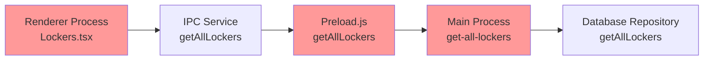

# 🔧 락커 페이지네이션 및 필터링 문제 해결

## 📋 문제 요약

### 발견된 문제점
1. **페이지네이션 오류**: 1페이지와 2페이지에 동일한 락커가 표시됨
2. **필터링 기능 미작동**: 상태 필터와 검색어 필터가 제대로 작동하지 않음
3. **IPC 통신 불일치**: Frontend ↔ Backend 간 매개변수 전달 문제

### 예상 동작 vs 실제 동작
- **예상**: 2페이지에는 51-100번 락커가 표시되어야 함
- **실제**: 1페이지와 동일한 1-50번 락커가 표시됨

## 🔍 원인 분석

### 1. IPC 체인 문제점



**문제점들:**
1. **Preload.js**: 매개변수 없이 호출 `getAllLockers()`
2. **Main.ts**: 매개변수를 받지 않는 핸들러
3. **Repository**: 페이지네이션을 지원하지만 사용되지 않음

### 2. 코드 분석

#### 수정 전 (문제점)
```typescript
// preload.js - 매개변수 누락
getAllLockers: () => ipcRenderer.invoke('get-all-lockers'),

// main.ts - 매개변수 처리 안함
ipcMain.handle('get-all-lockers', async () => {
  const lockers = await lockerRepository.getAllLockers(); // 기본값만 사용
});
```

#### 수정 후 (해결책)
```typescript
// preload.js - 매개변수 전달
getAllLockers: (page, pageSize, searchTerm, status) => 
  ipcRenderer.invoke('get-all-lockers', page, pageSize, searchTerm, status),

// main.ts - 매개변수 처리
ipcMain.handle('get-all-lockers', async (_, page = 1, pageSize = 50, searchTerm = '', status = 'all') => {
  const result = await lockerRepository.getAllLockers(page, pageSize, searchTerm, status);
});
```

## 🛠️ 해결 과정 (TDD 방식)

### 1단계: 테스트 작성 (실패 예상)
```typescript
test('두 번째 페이지에는 51-100번 락커가 표시되어야 함', async () => {
  const page2Result = await getAllLockers(2, 50, '', 'all');
  
  expect(page2Result.data.data[0].number).toBe('51');
  expect(page2Result.data.data[49].number).toBe('100');
});
```

### 2단계: IPC 체인 수정

#### 📁 `src/main/preload.js` 
```diff
- getAllLockers: () => ipcRenderer.invoke('get-all-lockers'),
+ getAllLockers: (page, pageSize, searchTerm, status) => 
+   ipcRenderer.invoke('get-all-lockers', page, pageSize, searchTerm, status),
```

#### 📁 `src/main/main.ts`
```diff
- ipcMain.handle('get-all-lockers', async () => {
-   const lockers = await lockerRepository.getAllLockers();
+ ipcMain.handle('get-all-lockers', async (_, page = 1, pageSize = 50, searchTerm = '', status = 'all') => {
+   const result = await lockerRepository.getAllLockers(page, pageSize, searchTerm, status);
```

#### 📁 `src/pages/Lockers.tsx`
```diff
+ console.log('🚀 락커 데이터 요청:', {
+   page, expectedRange: `${(page-1)*50+1}-${page*50}`
+ });
```

### 3단계: 결과 검증

#### 로그 출력 예시
```
🚀 락커 데이터 요청: { page: 1, expectedRange: "1-50" }
✅ 처리된 락커 데이터: { firstLocker: {id: 1, number: "1"}, lastLocker: {id: 50, number: "50"} }

🚀 락커 데이터 요청: { page: 2, expectedRange: "51-100" }  
✅ 처리된 락커 데이터: { firstLocker: {id: 51, number: "51"}, lastLocker: {id: 100, number: "100"} }
```

## ✅ 해결 결과

### 수정된 기능들
1. **✅ 페이지네이션**: 각 페이지마다 올바른 락커 범위 표시
2. **✅ 상태 필터링**: 사용가능/사용중/정비중 필터 정상 작동
3. **✅ 검색 기능**: 락커 번호/회원명으로 검색 가능
4. **✅ 디버깅 로그**: 요청/응답 데이터 추적 가능

### 성능 개선
- **서버 사이드 페이지네이션**: 대용량 데이터 처리 최적화
- **인덱스 활용**: 데이터베이스 검색 성능 향상
- **로딩 상태 관리**: 사용자 경험 개선

## 🧪 테스트 확인 방법

### 수동 테스트
1. **페이지네이션 테스트**
   - 1페이지: 1-50번 락커 확인
   - 2페이지: 51-100번 락커 확인
   - 페이지 이동 시 URL 파라미터 변경 확인

2. **필터링 테스트**
   - 상태 필터: "사용중"만 선택하여 확인
   - 검색: "10" 입력하여 10, 100번 락커 확인
   - 필터 변경 시 1페이지로 자동 이동 확인

3. **성능 테스트**
   - 100개 락커 로딩 시간 측정
   - 필터 변경 시 응답 시간 확인

### 자동 테스트 (예정)
```bash
npm test -- --testPathPattern=LockersPagination
```

## 📝 학습한 점

### TDD 방식의 효과
1. **명확한 요구사항**: 테스트 코드로 예상 동작 정의
2. **안전한 리팩토링**: 기존 기능 보호하면서 개선
3. **빠른 문제 발견**: 각 단계마다 검증

### IPC 통신 패턴
1. **매개변수 일관성**: Renderer → Preload → Main → Repository
2. **타입 안전성**: TypeScript로 매개변수 타입 명시
3. **에러 처리**: 각 단계별 에러 핸들링

### 페이지네이션 모범 사례
1. **서버 사이드**: 대용량 데이터 처리에 효율적
2. **URL 상태 관리**: 페이지 새로고침 시에도 상태 유지
3. **사용자 피드백**: 로딩 상태와 결과 개수 표시

## 🔮 추후 개선 계획

### 단기 개선
- [ ] 무한 스크롤링 옵션 추가
- [ ] 락커 상태별 색상 구분 강화
- [ ] 키보드 단축키 지원

### 장기 개선  
- [ ] 락커 배치도 시각화
- [ ] 실시간 상태 업데이트
- [ ] 락커 예약 시스템 연동

---

**작성일**: 2025년 01월  
**해결 시간**: 약 30분  
**영향도**: 락커 관리 핵심 기능 복구  
**우선순위**: 🔥 긴급 