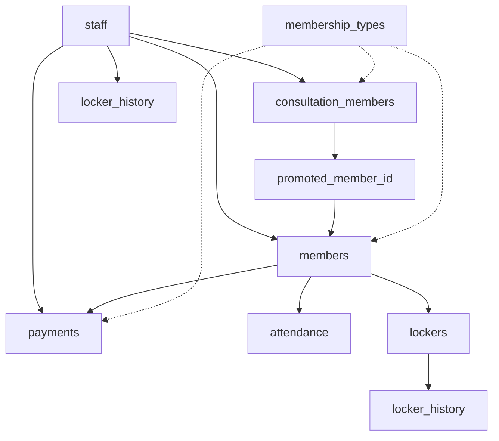

# 데이터베이스 스키마 요약 (v2.0)

이 문서는 현재 프로젝트의 SQLite 데이터베이스 스키마를 요약합니다.

## 데이터베이스 개요

-   **데이터베이스 종류**: SQLite
-   **데이터베이스 파일명**: `fitness.db` (사용자 데이터 폴더 내에 저장)
-   **라이브러리**: `better-sqlite3`
-   **총 테이블 수**: 9개 (기존 6개 + 신규 3개)

## 🆕 주요 변경사항 (v2.0)

### **신규 추가된 테이블**
1. `consultation_members` - 상담 회원 전용 관리
2. `locker_history` - 락커 사용 이력 추적
3. `migrations` - 데이터베이스 마이그레이션 관리

### **기존 테이블 스키마 변경**
- `membership_types`: 향상된 회원권 시스템 (PT/월간 구분)
- `staff`: 생년월일 컬럼 추가
- `members`: 담당 직원 정보 연동 강화

---

## 테이블 상세 정보

### 1. `members` - 정식 회원 정보

| 컬럼명             | 데이터 타입      | 제약 조건                               | 설명                                      |
| ------------------ | ---------------- | --------------------------------------- | ----------------------------------------- |
| `id`               | INTEGER          | PRIMARY KEY AUTOINCREMENT               | 회원 고유 ID                               |
| `name`             | TEXT             | NOT NULL                                | 회원 이름                                   |
| `phone`            | TEXT             |                                         | 전화번호                                  |
| `email`            | TEXT             |                                         | 이메일                                    |
| `gender`           | TEXT             |                                         | 성별                                      |
| `birth_date`       | INTEGER          |                                         | 생년월일 (Unix Timestamp)                   |
| `join_date`        | INTEGER          | NOT NULL                                | 가입일 (Unix Timestamp)                     |
| `membership_type`  | TEXT             |                                         | 현재 회원권 종류 (이름)                      |
| `membership_start` | INTEGER          |                                         | 현재 회원권 시작일 (Unix Timestamp)         |
| `membership_end`   | INTEGER          |                                         | 현재 회원권 종료일 (Unix Timestamp)         |
| `last_visit`       | INTEGER          |                                         | 마지막 방문일 (Unix Timestamp)              |
| `notes`            | TEXT             |                                         | 회원 관련 메모                              |
| `staff_id`         | INTEGER          |                                         | 담당 직원 ID (staff.id 참조, 외래 키 제약 없음) |
| `staff_name`       | TEXT             |                                         | 담당 직원 이름                              |
| `created_at`       | INTEGER          | DEFAULT (cast(strftime('%s', 'now') as integer)) | 생성일시 (Unix Timestamp)                 |
| `updated_at`       | INTEGER          | DEFAULT (cast(strftime('%s', 'now') as integer)) | 수정일시 (Unix Timestamp)                 |

**관계:**
-   `staff` 테이블과 `staff_id`로 연관될 수 있습니다. (외래 키 제약은 명시적으로 없음)
-   `attendance`, `payments`, `lockers` 테이블에서 참조됩니다.
-   `consultation_members` 테이블의 `promoted_member_id`로 참조됩니다.

### 2. `consultation_members` - 상담 회원 정보 🆕

| 컬럼명                 | 데이터 타입      | 제약 조건                               | 설명                                      |
| ---------------------- | ---------------- | --------------------------------------- | ----------------------------------------- |
| `id`                   | INTEGER          | PRIMARY KEY AUTOINCREMENT               | 상담 회원 고유 ID                            |
| `name`                 | TEXT             | NOT NULL                                | 상담자 이름                                 |
| `phone`                | TEXT             | NOT NULL                                | 전화번호 (필수)                             |
| `email`                | TEXT             |                                         | 이메일                                    |
| `gender`               | TEXT             |                                         | 성별                                      |
| `birth_date`           | INTEGER          |                                         | 생년월일 (Unix Timestamp)                   |
| `join_date`            | INTEGER          | NOT NULL                                | 최초 상담 신청일 (Unix Timestamp)            |
| `first_visit`          | INTEGER          |                                         | 첫 방문일 (Unix Timestamp)                  |
| `membership_type`      | TEXT             |                                         | 희망 회원권 종류                            |
| `membership_start`     | INTEGER          |                                         | 희망 회원권 시작일                           |
| `membership_end`       | INTEGER          |                                         | 희망 회원권 종료일                           |
| `last_visit`           | INTEGER          |                                         | 마지막 방문일 (Unix Timestamp)              |
| `notes`                | TEXT             |                                         | 상담 관련 메모                              |
| `staff_id`             | INTEGER          | FOREIGN KEY (staff.id)                  | 담당 직원 ID                                |
| `staff_name`           | TEXT             |                                         | 담당 직원 이름                              |
| `consultation_status`  | TEXT             | DEFAULT 'pending'                       | 상담 상태 (pending/in_progress/completed/cancelled) |
| `health_conditions`    | TEXT             |                                         | 건강 상태 정보                              |
| `fitness_goals`        | TEXT             |                                         | 운동 목표 (JSON 문자열)                      |
| `is_promoted`          | INTEGER          | DEFAULT 0                               | 정식 회원 승격 여부 (0: 미승격, 1: 승격)        |
| `promoted_at`          | INTEGER          |                                         | 승격일시 (Unix Timestamp)                   |
| `promoted_member_id`   | INTEGER          | FOREIGN KEY (members.id)                | 승격 후 정식 회원 ID                         |
| `created_at`           | INTEGER          | DEFAULT (cast(strftime('%s', 'now') as integer)) | 생성일시 (Unix Timestamp)                 |
| `updated_at`           | INTEGER          | DEFAULT (cast(strftime('%s', 'now') as integer)) | 수정일시 (Unix Timestamp)                 |

**관계:**
-   `staff` 테이블의 `id`를 `staff_id`로 참조합니다.
-   `members` 테이블의 `id`를 `promoted_member_id`로 참조합니다.

### 3. `attendance` - 출석 정보

| 컬럼명       | 데이터 타입 | 제약 조건                               | 설명                      |
| ------------ | ----------- | --------------------------------------- | ------------------------- |
| `id`         | INTEGER     | PRIMARY KEY AUTOINCREMENT               | 출석 고유 ID                |
| `member_id`  | INTEGER     | NOT NULL, FOREIGN KEY (members.id)      | 회원 ID                   |
| `visit_date` | INTEGER     | NOT NULL                                | 방문일 (Unix Timestamp)     |
| `created_at` | INTEGER     | DEFAULT (cast(strftime('%s', 'now') as integer)) | 생성일시 (Unix Timestamp)   |

**관계:**
-   `members` 테이블의 `id`를 `member_id`로 참조합니다.

### 4. `payments` - 결제 정보

| 컬럼명             | 데이터 타입      | 제약 조건                               | 설명                                      |
| ------------------ | ---------------- | --------------------------------------- | ----------------------------------------- |
| `id`               | INTEGER          | PRIMARY KEY AUTOINCREMENT               | 결제 고유 ID                               |
| `member_id`        | INTEGER          | NOT NULL, FOREIGN KEY (members.id)      | 회원 ID                                   |
| `amount`           | INTEGER          | NOT NULL                                | 결제 금액                                   |
| `payment_date`     | INTEGER          | NOT NULL                                | 결제일 (Unix Timestamp)                     |
| `payment_type`     | TEXT             | NOT NULL                                | 결제 구분 (예: 신규, 연장)                   |
| `payment_method`   | TEXT             |                                         | 결제 수단 (예: 카드, 현금)                  |
| `membership_type`  | TEXT             |                                         | 결제한 회원권 종류 (이름)                    |
| `start_date`       | INTEGER          |                                         | 회원권 시작일 (Unix Timestamp)              |
| `end_date`         | INTEGER          |                                         | 회원권 종료일 (Unix Timestamp)              |
| `receipt_number`   | TEXT             |                                         | 영수증 번호                                |
| `status`           | TEXT             | DEFAULT '완료'                          | 결제 상태 (예: 완료, 취소)                  |
| `description`      | TEXT             |                                         | 결제 상세 설명                              |
| `notes`            | TEXT             |                                         | 결제 관련 메모                              |
| `staff_id`         | INTEGER          | FOREIGN KEY (staff.id)                  | 결제 처리 직원 ID                            |
| `created_at`       | INTEGER          | DEFAULT (cast(strftime('%s', 'now') as integer)) | 생성일시 (Unix Timestamp)                 |

**관계:**
-   `members` 테이블의 `id`를 `member_id`로 참조합니다.
-   `staff` 테이블의 `id`를 `staff_id`로 참조합니다.

### 5. `membership_types` - 회원권 종류 정보 (향상된 스키마)

| 컬럼명                 | 데이터 타입      | 제약 조건                               | 설명                                  |
| ---------------------- | ---------------- | --------------------------------------- | ------------------------------------- |
| `id`                   | INTEGER          | PRIMARY KEY AUTOINCREMENT               | 회원권 종류 고유 ID                       |
| `name`                 | TEXT             | NOT NULL                                | 회원권 종류 이름                          |
| `price`                | INTEGER          | NOT NULL                                | 가격                                  |
| `duration_months`      | INTEGER          | NOT NULL DEFAULT 1                      | 기간 (개월 수)                            |
| `membership_category`  | TEXT             | DEFAULT 'monthly'                       | 🆕 회원권 카테고리 (monthly/pt)          |
| `pt_type`              | TEXT             |                                         | 🆕 PT 타입 (session_based/unlimited)   |
| `is_active`            | INTEGER          | DEFAULT 1                               | 활성화 여부 (1: 활성, 0: 비활성)           |
| `description`          | TEXT             |                                         | 설명                                  |
| `max_uses`             | INTEGER          |                                         | 최대 사용 횟수 (PT 등)                   |
| `available_facilities` | TEXT             |                                         | 이용 가능 시설 (JSON 문자열)              |
| `created_at`           | INTEGER          | DEFAULT (cast(strftime('%s', 'now') as integer)) | 생성일시 (Unix Timestamp)             |
| `updated_at`           | INTEGER          | DEFAULT (cast(strftime('%s', 'now') as integer)) | 수정일시 (Unix Timestamp)             |

**관계:**
-   `members` 테이블의 `membership_type` 컬럼과 이름으로 연관될 수 있습니다.
-   `payments` 테이블의 `membership_type` 컬럼과 이름으로 연관될 수 있습니다.

### 6. `staff` - 직원 정보 (생년월일 추가)

| 컬럼명        | 데이터 타입      | 제약 조건                               | 설명                                   |
| ------------- | ---------------- | --------------------------------------- | -------------------------------------- |
| `id`          | INTEGER          | PRIMARY KEY AUTOINCREMENT               | 직원 고유 ID                             |
| `name`        | TEXT             | NOT NULL                                | 직원 이름                                |
| `position`    | TEXT             | NOT NULL                                | 직책                                   |
| `phone`       | TEXT             |                                         | 전화번호                                 |
| `email`       | TEXT             |                                         | 이메일                                   |
| `hire_date`   | INTEGER          | NOT NULL                                | 고용일 (Unix Timestamp)                  |
| `birth_date`  | INTEGER          |                                         | 🆕 생년월일 (Unix Timestamp)            |
| `status`      | TEXT             | NOT NULL                                | 근무 상태 (예: 재직, 퇴사)               |
| `permissions` | TEXT             | NOT NULL                                | 권한 정보 (JSON 문자열)                  |
| `notes`       | TEXT             |                                         | 직원 관련 메모                             |
| `created_at`  | INTEGER          | DEFAULT (cast(strftime('%s', 'now') as integer)) | 생성일시 (Unix Timestamp)              |
| `updated_at`  | INTEGER          | DEFAULT (cast(strftime('%s', 'now') as integer)) | 수정일시 (Unix Timestamp)              |

**관계:**
-   `payments` 테이블에서 `staff_id`로 참조됩니다.
-   `members` 테이블의 `staff_id` 컬럼과 연관될 수 있습니다. (외래 키 제약은 명시적으로 없음)
-   `consultation_members` 테이블에서 `staff_id`로 참조됩니다.

### 7. `lockers` - 락커 정보

| 컬럼명        | 데이터 타입      | 제약 조건                               | 설명                               |
| ------------- | ---------------- | --------------------------------------- | ---------------------------------- |
| `id`          | INTEGER          | PRIMARY KEY AUTOINCREMENT               | 락커 고유 ID                         |
| `number`      | TEXT             | NOT NULL UNIQUE                         | 락커 번호                          |
| `status`      | TEXT             | NOT NULL DEFAULT 'available'            | 상태 (예: available, occupied, maintenance) |
| `size`        | TEXT             |                                         | 크기                               |
| `location`    | TEXT             |                                         | 위치                               |
| `fee_options` | TEXT             |                                         | 요금 옵션 (JSON 문자열)               |
| `member_id`   | INTEGER          | FOREIGN KEY (members.id) ON DELETE SET NULL | 사용 회원 ID (회원 삭제 시 NULL로 설정) |
| `start_date`  | INTEGER          |                                         | 사용 시작일 (Unix Timestamp)         |
| `end_date`    | INTEGER          |                                         | 사용 종료일 (Unix Timestamp)         |
| `notes`       | TEXT             |                                         | 락커 관련 메모                       |
| `created_at`  | INTEGER          | DEFAULT (cast(strftime('%s', 'now') as integer)) | 생성일시 (Unix Timestamp)          |
| `updated_at`  | INTEGER          | DEFAULT (cast(strftime('%s', 'now') as integer)) | 수정일시 (Unix Timestamp)          |

**관계:**
-   `members` 테이블의 `id`를 `member_id`로 참조합니다. 회원 삭제 시 `member_id`는 `NULL`로 설정됩니다.

### 8. `locker_history` - 락커 사용 이력 🆕

| 컬럼명             | 데이터 타입      | 제약 조건                               | 설명                               |
| ------------------ | ---------------- | --------------------------------------- | ---------------------------------- |
| `id`               | INTEGER          | PRIMARY KEY AUTOINCREMENT               | 이력 고유 ID                         |
| `locker_id`        | INTEGER          | NOT NULL, FOREIGN KEY (lockers.id)      | 락커 ID                            |
| `locker_number`    | TEXT             | NOT NULL                                | 락커 번호                           |
| `member_id`        | INTEGER          | FOREIGN KEY (members.id)                | 사용 회원 ID                        |
| `member_name`      | TEXT             |                                         | 회원 이름 (스냅샷)                   |
| `action`           | TEXT             | NOT NULL                                | 작업 유형 (대여/반납/연장/해지)        |
| `start_date`       | INTEGER          |                                         | 사용 시작일 (Unix Timestamp)         |
| `end_date`         | INTEGER          |                                         | 사용 종료일 (Unix Timestamp)         |
| `payment_amount`   | INTEGER          |                                         | 결제 금액                           |
| `payment_method`   | TEXT             |                                         | 결제 방법                           |
| `notes`            | TEXT             |                                         | 이력 관련 메모                       |
| `staff_id`         | INTEGER          | FOREIGN KEY (staff.id)                  | 처리 직원 ID                        |
| `staff_name`       | TEXT             |                                         | 처리 직원 이름 (스냅샷)               |
| `created_at`       | INTEGER          | DEFAULT (cast(strftime('%s', 'now') as integer)) | 생성일시 (Unix Timestamp)          |

**관계:**
-   `lockers` 테이블의 `id`를 `locker_id`로 참조합니다.
-   `members` 테이블의 `id`를 `member_id`로 참조합니다.
-   `staff` 테이블의 `id`를 `staff_id`로 참조합니다.

### 9. `migrations` - 마이그레이션 관리 🆕

| 컬럼명         | 데이터 타입      | 제약 조건                               | 설명                               |
| -------------- | ---------------- | --------------------------------------- | ---------------------------------- |
| `id`           | INTEGER          | PRIMARY KEY AUTOINCREMENT               | 마이그레이션 고유 ID                  |
| `name`         | TEXT             | NOT NULL UNIQUE                         | 마이그레이션 이름                    |
| `executed_at`  | INTEGER          | DEFAULT (cast(strftime('%s', 'now') as integer)) | 실행일시 (Unix Timestamp)          |

**관계:**
-   독립적인 시스템 테이블로 다른 테이블과 직접적인 관계 없음

---

## 데이터 연동성 및 추가 사용 데이터

### **테이블 간 연동 관계**

### **핵심 데이터 플로우**

1. **상담 회원 → 정식 회원 승격**:
   - `consultation_members` → `members` (승격)
   - `consultation_members.promoted_member_id` → `members.id`

2. **회원권 관리**:
   - `membership_types` → `members.membership_type`
   - `payments` → 결제 시 회원권 정보 기록

3. **락커 이력 추적**:
   - `lockers` 상태 변경 시 → `locker_history` 기록

### **데이터 처리 원칙**

-   **날짜 데이터 처리**: 모든 날짜/시간 관련 데이터는 Unix Timestamp (초 단위 정수) 형태로 저장되며, 애플리케이션 코드 내에서 ISO 형식의 문자열 (YYYY-MM-DD) 또는 Date 객체로 변환되어 사용됩니다.
-   **JSON 데이터 활용**: `staff` 테이블의 `permissions`, `membership_types` 테이블의 `available_facilities`, `lockers` 테이블의 `fee_options`, `consultation_members` 테이블의 `fitness_goals` 컬럼은 JSON 문자열 형태로 복합적인 데이터를 저장합니다.
-   **외래 키 제약 조건**: 대부분의 테이블이 외래 키 제약 조건을 가지며, 참조 무결성을 보장합니다.
-   **상태 관리**: 상담 회원의 승격, 락커 상태 변경 등 중요한 상태 변화는 이력 테이블에 기록됩니다.

### **인덱싱 최적화**

성능 향상을 위해 다음 컬럼들에 인덱스가 생성되어 있습니다:
- `members.name`, `members.phone`
- `attendance.member_id`, `attendance.visit_date`
- `payments.member_id`, `payments.payment_date`
- `lockers.number`, `lockers.member_id`

### **데이터 무결성**

-   **트랜잭션 처리**: 회원 삭제, 승격 처리 등 복합적인 작업은 트랜잭션으로 처리되어 데이터 무결성을 유지합니다.
-   **캐스케이드 삭제**: 회원 삭제 시 관련된 출석(`attendance`) 및 결제(`payments`) 기록도 함께 삭제됩니다.
-   **소프트 업데이트**: 락커의 경우 할당된 회원이 삭제되면 `member_id`가 `NULL`로 설정되도록 `ON DELETE SET NULL` 제약 조건이 설정되어 있습니다.

---

## 🚀 향후 개선 계획

### **성능 최적화**
- [ ] 추가 인덱스 생성 (복합 인덱스 포함)
- [ ] 쿼리 최적화 및 성능 모니터링
- [ ] 대용량 데이터 처리를 위한 파티셔닝 검토

### **기능 확장**
- [ ] 실시간 알림을 위한 이벤트 테이블 추가
- [ ] 회원권 사용 내역 상세 추적
- [ ] 다중 지점 관리를 위한 지점별 데이터 분리

### **데이터 안전성**
- [ ] 자동 백업 시스템 강화
- [ ] 데이터 암호화 검토
- [ ] 감사 로그 시스템 구축

---

**작성일**: 2025년 01월
**작성자**: AI Assistant  
**버전**: 2.0.0 (Major Update)

> 📝 **참고**: 이 문서는 프로젝트의 발전과 함께 지속적으로 업데이트되며, 상담 회원 시스템과 통합 회원 관리 기능을 완전히 반영한 최신 버전입니다. 